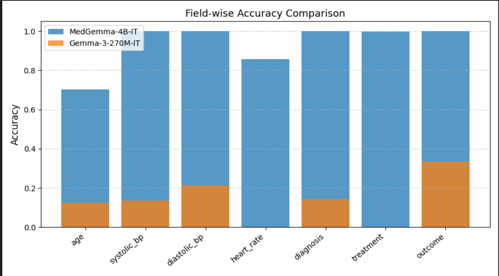

# 🏥 Clinical Information Extraction — vLLM Evaluation on Gemma & MedGemma

This repository benchmarks **Google’s Gemma and MedGemma models** for structured information extraction from clinical narratives, using a standardized JSON output format and evaluated on accuracy and macro-F1 metrics.

The goal is to assess **LLM precision and domain adaptability** for converting free-text clinical notes into structured fields like *vitals, diagnosis, and outcomes*.

---

## 🚀 Overview

### **Task Definition**

Given a free-text clinical narrative, the model must extract a compact JSON object with the following fields (if present):

| Field                         | Type    | Description                                          |
| :---------------------------- | :------ | :--------------------------------------------------- |
| `sex`                         | string  | "male" / "female"                                    |
| `age`                         | integer | Age in years                                         |
| `systolic_bp`, `diastolic_bp` | integer | Blood pressure in mmHg                               |
| `heart_rate`                  | integer | Pulse in bpm                                         |
| `diagnosis`                   | string  | Primary diagnosis                                    |
| `treatment`                   | string  | Administered or prescribed treatment                 |
| `outcome`                     | string  | Patient outcome (e.g., stable, improved, discharged) |

### **Prompt Example**

> ```
> You are an information extraction assistant for clinical notes.
> Your job is to read a single clinical narrative and output ONLY a compact JSON object
> with these keys if present: sex, age, systolic_bp, diastolic_bp, heart_rate, diagnosis, treatment, outcome.
>
> Rules:
> • Use lower case for strings ("male", "female", "discharged", etc.).
> • Age must be an integer number of years.
> • systolic_bp and diastolic_bp are integers (mmHg).
> • If a field is unknown or not stated, omit it.
> • Do not include any extra keys or commentary.
>
> Example output:
> {"sex":"female","age":54,"systolic_bp":118,"diastolic_bp":76,"diagnosis":"hypertension","treatment":"amlodipine","outcome":"stable"}
>
> Text:
> in the 8 decade of life presented for evaluation. ... arterial tension measured approximately 178/70 mmHg pulse ~84 bpm ...
> ```

---

## ⚙️ System Setup

All benchmarks were performed on **Google Cloud Compute Engine**:

| Parameter          | Value              |
| :----------------- | :----------------- |
| **Machine Type**   | `g2-standard-4`    |
| **vCPUs / Memory** | 4 vCPUs, 16 GB RAM |
| **CPU Platform**   | Intel Cascade Lake |
| **Architecture**   | x86/64             |
| **GPU**            | 1 × NVIDIA L4      |
| **Display Device** | Disabled           |

---

## 🗂️ Repository Structure

| File                        | Purpose                                                                                                                 |
| :-------------------------- | :---------------------------------------------------------------------------------------------------------------------- |
| `inference_vllm.py`         | Concurrent vLLM runner that queries models via the OpenAI-compatible REST API. Supports batching & concurrency scaling. |
| `prompt_template.txt`       | Template defining extraction rules, JSON schema, and example format.                                                    |
| `evaluation.py`             | Computes accuracy and macro-F1 by comparing model outputs with gold labels, using per-field normalization.              |
| `plot.py`                   | Generates comparative performance plots between Gemma and MedGemma models.                                              |
| `model_eval_comparison.png` | Visualization output showing field-wise accuracy comparison.                                                            |

---

## 🧠 Models Evaluated

| Model               | Description                                           |
| :------------------ | :---------------------------------------------------- |
| **Gemma-3-270M-IT** | General instruction-tuned model, not domain-specific. |
| **MedGemma-4B-IT**  | Biomedical variant fine-tuned on medical corpora.     |

---

## 🗳️ Benchmark Results

### Overall Performance

| Model               |  Accuracy  |  Macro F1  |
| :------------------ | :--------: | :--------: |
| **MedGemma-4B-IT**  | **0.9361** | **0.9458** |
| **Gemma-3-270M-IT** |   0.1364   |   0.1469   |

---

### Field-wise Accuracy Comparison

| Field        | MedGemma-4B | Gemma-3 | Δ (4B-3) |
| :----------- | :---------: | :-----: | :------: |
| age          |    0.702    |  0.124  |  +0.578  |
| systolic_bp  |    0.999    |  0.135  |  +0.864  |
| diastolic_bp |    0.999    |  0.214  |  +0.785  |
| heart_rate   |    0.857    |  0.000  |  +0.857  |
| diagnosis    |    1.000    |  0.145  |  +0.855  |
| treatment    |    0.997    |  0.002  |  +0.995  |
| outcome      |    1.000    |  0.335  |  +0.665  |

🦧 **Observation:**
The MedGemma-4B model achieves near-perfect structured extraction performance, while the smaller Gemma-3 model struggles to generalize on clinical semantics and numeric field consistency.

---

## ⚡ Performance Benchmarks (vLLM)

| Model / Concurrency    | Runtime |
| :--------------------- | :-----: |
| Gemma-3-270M-IT @ 50   |   41 s  |
| Gemma-3-270M-IT @ 100  |   36 s  |
| Gemma-3-270M-IT @ 500  |   30 s  |
| Gemma-3-270M-IT @ 1000 |   30 s  |
| MedGemma-4B-IT @ 1000  |  ~120 s |

> ✅ Gemma scales almost linearly up to 1000 concurrent requests under vLLM’s async inference engine.
> ⚠️ MedGemma, being ~15× larger, saturates GPU memory, leading to higher latency (~2 min per batch).

---

## 📊 Visualization

The field-wise comparison plot (from `plot.py`) illustrates the dominance of MedGemma across all key extraction fields:



---

## 🤍 Usage

### **1. Run inference**

```bash
export VLLM_ENDPOINT=http://127.0.0.1:8000/v1
export OPENAI_API_KEY=dummy

python inference_vllm.py \
  --model google/gemma-3-270m-it \
  --out gemma3_outputs.jsonl \
  --notes synthetic_notes.jsonl \
  --batch-size 100 \
  --limit 2000
```

### **2. Evaluate predictions**

```bash
python evaluation.py ground_truth.jsonl gemma3_outputs.jsonl
```

### **3. Plot results**

```bash
python plot.py
```

---

## 🧮 Metrics Explained

* **Accuracy:** proportion of correctly predicted fields across all samples.
* **Macro F1:** averaged F1 across all fields, accounting for both precision and recall.
* **Tolerance:** BP fields allow ±5 mmHg difference as correct.

---

## 📈 Key Takeaways

* MedGemma 4B demonstrates exceptional precision and structured understanding of medical narratives.
* Smaller Gemma 3 models are viable for latency-critical inference but trade off heavily on accuracy.
* vLLM offers excellent scalability, achieving sub-40s inference for 1000 parallel Gemma requests on a single L4 GPU.

---

## 🧮 Future Work

* Extend benchmarks to Mistral-7B-Instruct and Llama-3-Instruct for open-domain baselines.
* Incorporate **entity alignment metrics** for partial extractions.
* Experiment with quantization and LoRA-fine-tuning for cost-efficient inference.

---

**Author:** Nitin Bhat
**Platform:** Google Cloud GPU (NVIDIA L4)
**License:** MIT
